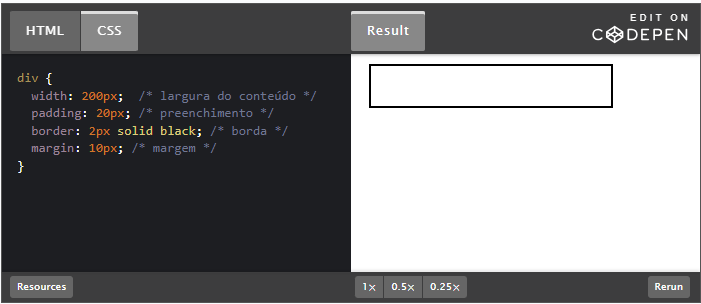

# Introdução
Olá, pessoa incrível! Hoje vamos abordar um tema que considero fundamental para qualquer pessoa que esteja na área de desenvolvimento web, ou até mesmo para aquelas que estão pensando em entrar nesse maravilhoso mundo. Vamos falar de CSS — Cascading Style Sheets. Prepare-se para mergulhar nessa aventura!

<h3>O que é CSS?</h3>
Olá, pessoa incrível! Hoje vamos embarcar em uma aventura empolgante inspirada na lendária personagem Indiana Jones! Imagine que você é uma pessoa arqueóloga apaixonada por descobertas históricas e tesouros antigos. Assim como Indiana Jones, você está em busca de conhecimento e aventuras emocionantes. No entanto, em vez de explorar templos e ruínas antigas, a sua missão é desvendar os segredos do CSS (Cascading Style Sheets) — e dominar essa linguagem poderosa.

Assim como Indiana Jones enfrentava obstáculos desafiadores em suas expedições, você também enfrenta dificuldades em dominar o CSS. Você sabe que o CSS é essencial para criar belos e atraentes sites, mas sente-se perdido no meio de seletores, propriedades e valores. Você precisa desvendar esses mistérios e encontrar uma forma de aplicar corretamente o CSS em seus projetos.

Nesta jornada cheia de emoção e aventura, vamos seguir os passos de Indiana Jones e explorar os segredos ocultos do CSS. Assim como ele usava sua inteligência, habilidades, e ferramentas para superar desafios, decifrar hieróglifos e símbolos enigmáticos, você aprenderá sobre seletores, regras de estilo e blocos de declaração, vou te dar um gostinho, vamos a um exemplo:
~~~
seletor {
  propriedade: valor;
}
~~~
Veja que temos o seletor, que define a qual elemento HTML o estilo será aplicado, seguido por um bloco de declarações (dentro das chaves {}). Dentro desse bloco, temos a propriedade que queremos alterar e o valor dessa propriedade. Simples, não é mesmo?

Vamos agora a um exemplo prático:

Neste caso, o p é o seletor, que neste caso se refere a todos os parágrafos do nosso documento. A propriedade que estamos modificando é a color e o valor dessa propriedade é red (vermelho). Portanto, com essa regra de estilo, estamos fazendo com que todos os parágrafos do nosso documento sejam exibidos na cor vermelha.

O CSS permitirá que você controle a aparência e o estilo dos elementos de um site, assim como Indiana Jones desvendava enigmas e encontrava tesouros valiosos. Prepare-se para embarcar nessa aventura empolgante e descobrir os segredos do CSS! Não perca os próximos capítulos no universo do CSS!

Importância do CSS no desenvolvimento web
Da mesma maneira que Indiana Jones precisa de seu chicote para se aventurar pelas cavernas escuras e resolver enigmas, nós, desenvolvedores web, precisamos do CSS para criar sites atraentes e funcionais. Por quê? Vamos explorar juntos.

Indiana Jones dizendo “yes” no filme Indiana Jones e os caçadores da arca perdida.
Sem o CSS, nossos sites seriam como um mapa sem legendas — tecnicamente útil, mas incrivelmente difícil de entender. Um bom design não é apenas sobre tornar um site bonito, mas também melhorar a experiência do usuário. O CSS nos permite fazer isso, proporcionando uma experiência de usuário suave e agradável.

Você se lembra daquela cena em "Indiana Jones e a Última Cruzada" em que Indy escolhe o cálice certo entre tantos outros brilhantes, mas enganosos? Pois bem, o CSS é esse cálice humilde, mas valioso que torna tudo possível. Pode não ter o brilho imediato de outras tecnologias, mas sem ele, nossos sites seriam muito menos atraentes e eficazes.

Além disso, o CSS é essencial para a criação de sites responsivos. Com o aumento do uso de dispositivos móveis para acessar a web, é cada vez mais importante que nossos sites se adaptem a diferentes tamanhos de tela. Com o CSS, podemos garantir que nossos sites sejam tão bonitos e funcionais em um smartphone quanto em um desktop.

Por último, mas não menos importante, o CSS tem um papel crucial na acessibilidade na web. Ele nos permite criar sites que são acessíveis a todas as pessoas, independentemente de suas habilidades ou das tecnologias assistivas que possam estar usando.

Portanto, a importância do CSS no desenvolvimento web é indiscutível. Ele é a ponte de corda que nos permite cruzar o precipício do design funcional, a chave que nos ajuda a decifrar o enigma da experiência do usuário. Como Indy, devemos valorizar essa ferramenta e aproveitar ao máximo o seu potencial.

<h4>Vantagens do uso do CSS</h4>
O CSS oferece uma variedade de vantagens que podem transformar a aparência e o funcionamento dos sites. Com o CSS, é possível:

Personalizar totalmente o visual do site;
Garantir a eficiência e reutilização de código;
Criar sites responsivos;
Melhorar a acessibilidade; e
Facilitar a manutenção do projeto.

1) Personalização à vontade
Com o CSS, você tem controle total sobre o visual do site. É possível definir cores, fontes, espaçamentos e muito mais, permitindo uma personalização completa para atender às suas preferências.

2) Eficiência e reutilização de código
O CSS permite escrever regras que podem ser aplicadas em vários elementos do site, evitando a repetição de estilos específicos. Isso resulta em menos código para escrever e manter, tornando o processo mais eficiente.

3) Site responsivo
Com as media queries do CSS, é possível adaptar o design do site de acordo com as características do dispositivo do usuário. Isso garante que o site seja visualmente atraente e funcional em diferentes tamanhos de tela, como smartphones, tablets e computadores.

4) Melhora a acessibilidade
O CSS desempenha um papel importante na criação de sites acessíveis. É possível ajustar o contraste das cores, o tamanho das fontes e outras características visuais para tornar o site mais acessível para usuários com deficiências visuais ou outras necessidades especiais.

5) Manutenção facilitada
Separar o design (CSS) do conteúdo (HTML) torna a manutenção do site mais fácil. Alterações no design podem ser feitas sem afetar o código HTML, simplificando o processo de manutenção e reduzindo a possibilidade de erros.

Assim como Indiana Jones desvendava segredos e encontrava tesouros valiosos, o CSS é uma ferramenta essencial para desvendar o potencial visual e funcional dos sites. Aproveite todas as vantagens do CSS e transforme suas criações web em verdadeiras jóias da internet!

<h4>História do CSS</h4>
Compartilhar histórias é sempre uma aventura incrível. Assim como em qualquer grande saga, a trajetória do CSS também tem seu início, altos e baixos, e momentos marcantes. Então, prepare-se para embarcar nessa jornada ao passado!

<h4>Surgimento do CSS</h4>
Em uma época muito distante, mais precisamente em 1994, um engenheiro chamado Håkon Wium Lie propôs algo novo: uma linguagem de estilização que poderia resolver o caos visual do HTML da época. Ele imaginou uma maneira mais prática de implementar e controlar estilos visuais para páginas web. E foi assim que, em parceria com o W3C (World Wide Web Consortium), surgiu o CSS — Cascading Style Sheets.

<h4>Versões do CSS</h4>
Assim como o tempo não para, o CSS também não ficou estagnado. A sua evolução veio em ondas, chamadas de níveis em vez de versões.

CSS1: foi a primeira versão oficial, publicada em 1996. Foi um grande passo à frente, já que permitiu aos desenvolvedores separar o conteúdo do design em seus sites pela primeira vez;

CSS2: lançado em 1998, trouxe novas funcionalidades como suporte para media types, que permitia a criação de estilos diferentes para impressão e visualização na tela, por exemplo;

CSS3: aqui, as coisas ficaram um pouco mais complicadas. Em vez de lançar uma nova versão completa, o CSS3 foi dividido em módulos menores, cada um lidando com diferentes aspectos do CSS. Entre os avanços notáveis estão os efeitos de animação, transições e transformações, além do adorável flexbox.

Principais marcos e avanços na evolução do CSS
Nessa longa trajetória, tivemos muitos marcos importantes. Dentre eles, podemos destacar:

Seletores Avançados: introduzidos com o CSS3, eles deram aos desenvolvedores muito mais controle sobre quais elementos do DOM deveriam ser estilizados;

Media Queries: essa é uma das principais ferramentas que permitem a criação de sites responsivos. As Media Queries permitem que você aplique estilos diferentes dependendo das características do dispositivo do usuário;

Flexbox e Grid: ambos trouxeram uma revolução no design de layouts para a web, tornando muito mais fácil criar designs complexos e responsivos;

Variáveis CSS: permitiram a definição de valores reutilizáveis ​​em todo o seu CSS, o que facilita muito a manutenção do código.

A viagem pela história do CSS é fascinante, não é mesmo? Agora que você já conhece um pouco mais sobre sua origem e evolução, está pronto para aprender mais.

<h3>Estrutura e Sintaxe do CSS</h3>
Se a Web fosse uma grande aventura, o CSS seria nosso mapa. E, para navegar nesse mapa, precisamos entender a sua estrutura e a sua sintaxe. Afinal, você não quer se perder em um labirinto de código, não é mesmo?

1) Anatomia de uma regra CSS
Vamos começar pelo básico. Uma regra CSS é composta por:

Um seletor; e
Um bloco de declaração.

O seletor indica a quem a regra se aplica, e o bloco de declaração contém uma ou mais declarações que são aplicadas ao elemento selecionado.

Uma declaração, por sua vez, é composta por uma propriedade e um valor, separados por dois pontos. Ficaria assim:
~~~
seletor {
  propriedade: valor;
}
~~~
Bem simples, né? Agora vamos olhar mais de perto para cada parte desta regra.

2) Seletores CSS
Os seletores são como os nossos detetives. Eles vão à procura dos elementos que correspondem ao padrão que definimos. Existem vários tipos de seletores em CSS, mas aqui estão alguns dos mais usados:

Tipo: selecione elementos pelo nome do elemento, como p, div, h1, etc;
Classe: selecione elementos pela classe, usando um ponto (.) seguido do nome da classe;
ID: selecione elementos pelo ID, usando uma hashtag (#) seguida do nome do ID.
Exemplos CSS de uso dos seletores de tipo, classe e ID.

3) Propriedades CSS
As propriedades são como os superpoderes dos elementos. Elas controlam tudo, desde a cor do texto até o tamanho da borda, passando pela fonte e o espaçamento. O CSS possui centenas de propriedades diferentes, o que proporciona um nível incrível de controle sobre a aparência de uma página web.

4) Valores e unidades no CSS
Cada propriedade tem um conjunto específico de valores que pode aceitar. Alguns são bastante simples, como auto ou none. Outros podem ser números, cores ou mesmo uma string de texto.

Muitos valores numéricos em CSS são acompanhados por uma unidade de medida. Por exemplo, você pode definir a largura de uma div em pixels (px), porcentagem (%), ems (em), ou várias outras unidades. Cada uma tem suas próprias características e usos.

Entender a estrutura e a sintaxe do CSS é como ter o mapa da mina em mãos. E agora que você já tem esse conhecimento, está mais que preparado para encontrar o tesouro que é criar estilos incríveis para a web.

Box Model e Layout
Se você já teve que empacotar presentes, sabe que é preciso ter um bom entendimento de como as caixas funcionam para conseguir um bom resultado. Da mesma maneira, entender o modelo de caixa (Box Model) é fundamental para trabalhar com CSS. Vamos explorar esse universo agora.

1) Conceito de Box Model
No CSS, cada elemento é considerado como uma caixa retangular. Essa caixa é descrita por um modelo conhecido como Box Model, que é dividido em quatro áreas:

Conteúdo (content);
Preenchimento (padding);
Borda (border); e
Margem (margin).
Juntas, essas áreas definem como os elementos se relacionam entre si e como eles ocupam espaço na página.

2) Margem, borda e preenchimento (margin, border, padding)
Agora, vamos desempacotar cada parte do Box Model:

Margem (margin): é o espaço ao redor da caixa. Pense nela como um buffer que separa o elemento dos outros ao seu redor;

Borda (border): é a linha que envolve o preenchimento e o conteúdo;

Preenchimento (padding): é o espaço entre a borda e o conteúdo. Ele é como uma almofada que protege o conteúdo da borda;

3) Posicionamento de elementos
O posicionamento de elementos em CSS pode parecer uma versão de Tetris às vezes, onde estamos tentando encaixar diferentes blocos em um espaço limitado. Temos várias propriedades para controlar o posicionamento, incluindo:

position;
top;
right;
bottom;
left; e
z-index.
Com elas, você pode mover elementos para cima e para baixo, esquerda e direita, e até mesmo controlar o que fica na frente e o que fica atrás.

4) Layouts responsivos com CSS
Vamos pensar na responsividade como uma característica de um camaleão, adaptando-se ao ambiente. No caso do CSS, o ambiente são os diferentes tamanhos de tela e dispositivos. Usando media queries, podemos alterar estilos com base no tamanho da tela, criando uma experiência que se adapta ao dispositivo do usuário.
~~~
@media (max-width: 600px) {
  div {
    width: 100%;
  }
}
~~~
Entender o Box Model e o layout é como ter um mapa do tesouro que guia a localização e o posicionamento dos elementos na nossa página. E é incrível ver como o CSS nos dá o poder de transformar a Web de acordo com nossa vontade.

Estilização de Texto e Tipografia
Você sabe quando entra em uma loja e o vendedor imediatamente reconhece que você procura algo único, que fala sobre quem você é? Assim funciona a estilização de texto e tipografia em CSS: elas definem a personalidade e a aparência do seu conteúdo escrito, criando uma experiência de leitura única.

1) Propriedades de texto
CSS nos oferece uma paleta cheia de opções para moldar nosso texto. Temos propriedades como:

color para alterar a cor;
text-decoration para adicionar ou remover sublinhados; e
Até mesmo text-transform para alterar a capitalização do texto.
É como se estivéssemos em uma loja de chapéus, escolhendo a melhor peça para expressar nossa personalidade.

2) Fontes e tipografia
As fontes são para o nosso texto o que a trilha sonora é para um filme, elas estabelecem o tom, acentuam o clima e acrescentam uma camada extra de significado para a nossa mensagem. No CSS, podemos manipular a fonte de nosso texto com algumas propriedades específicas:

font-family;
font-size;
font-weight; e
font-style.

Além das fontes padrão que todos os navegadores conhecem, também temos a capacidade de usar qualquer fonte que quisermos em nossos projetos web. Tal qual Indiana Jones em busca de relíquias antigas, podemos vasculhar a internet em busca da fonte perfeita para nossa aventura web. E quando a encontramos, podemos trazê-la para nosso site com a ajuda do @font-face.

O @font-face é uma regra especial que nos permite importar fontes de arquivos externos para o nosso CSS. Ele precisa de algumas informações para funcionar corretamente, como:

O nome da fonte (font-family);
O caminho para o arquivo da fonte (src); e
Outros parâmetros opcionais como font-weight e font-style.
~~~
@font-face {
  font-family: 'MinhaFontePersonalizada';
  src: url('MinhaFontePersonalizada.woff2') format('woff2'),
       url('MinhaFontePersonalizada.woff') format('woff');
  font-weight: normal;
  font-style: normal;
}
~~~
Depois que a fonte é declarada com @font-face, ela pode ser usada em todo o nosso CSS, como qualquer outra fonte.
~~~
h1 {
  font-family: 'MinhaFontePersonalizada', Arial, sans-serif;
}
~~~
Agora, com a capacidade de manipular e importar fontes, você possui um dos mais poderosos instrumentos na sinfonia que é o CSS. Cada palavra, cada frase, cada parágrafo podem agora dançar ao ritmo da sua música.

3) Efeitos de texto
Os efeitos de texto no CSS são como os acessórios que adicionamos ao nosso look. Com text-shadow, podemos adicionar sombras ao nosso texto, ou com text-overflow, podemos controlar como o texto será exibido quando ultrapassar o limite de sua caixa. É o toque final que dá um brilho extra ao nosso trabalho.

4) Espaçamento e alinhamento de texto
Finalmente, temos o espaçamento e alinhamento, que são como a postura e a maneira como nos apresentamos. Com line-height, text-align, letter-spacing e word-spacing, podemos controlar a distribuição e a organização do nosso texto, criando uma leitura confortável e agradável.

Neste tópico, exploramos como as propriedades CSS podem transformar nosso texto, ajudando-o a expressar exatamente o que queremos. Lembre-se: na moda e no CSS, cada detalhe conta!

Cores e Gradientes
As cores no CSS são como os efeitos especiais em um filme. Elas adicionam vida, criam atmosfera e podem até mesmo contar uma história. Então, como podemos pintar nossa tela digital?

1) Especificação de cores no CSS
Existem várias maneiras de especificar cores no CSS. Podemos usar nomes de cores predefinidos, como 'red' para vermelho, 'blue' para azul e assim por diante. Também podemos usar códigos hexadecimais, RGB, RGBA, HSL e HSLA.
~~~
p {
  color: red; /* nome da cor */
}
~~~
~~~
h1 {
  color: #ff0000; /* hexadecimal */
}
~~~
~~~
div {
  color: rgb(255, 0, 0); /* RGB */
}
~~~
~~~
span {
  color: rgba(255, 0, 0, 0.5); /* RGBA, com transparência */
}
~~~
~~~
header {
  color: hsl(0, 100%, 50%); /* HSL */
}
~~~
~~~
footer {
  color: hsla(0, 100%, 50%, 0.5); /* HSLA, com transparência */
}
~~~
2) Uso de cores sólidas
O uso de cores sólidas no CSS é bastante simples. Para aplicar uma cor a um elemento, basta usar a propriedade color para a cor do texto ou a propriedade background-color para a cor de fundo.

3) Gradientes lineares e radiais
O CSS também permite a criação de gradientes, que são transições suaves entre duas ou mais cores. Existem dois tipos de gradientes que podemos criar:

Lineares; e
Radiais.
Para criar um gradiente linear, usamos a função linear-gradient().

Para criar um gradiente radial, usamos a função radial-gradient().

4) Transparência e opacidade
A transparência pode ser especificada no CSS usando o formato RGBA ou HSLA para cores, ou a propriedade opacity. A propriedade opacity aplica uma transparência ao elemento inteiro, incluindo todo o seu conteúdo.

Assim como um pintor tem um arco-íris de cores à sua disposição, também temos um espectro ilimitado de cores à nossa disposição no CSS. Com as cores e gradientes, podemos criar designs vibrantes, dramáticos ou sutis, e transmitir o tom exato que queremos para nossa aplicação.

Estilização de Elementos
Com o CSS, somos capazes de estilizar virtualmente qualquer elemento em uma página web, permitindo que criemos designs visualmente atraentes e experiências de usuário envolventes. Vamos explorar como podemos estilizar alguns dos elementos mais comuns em um site: links, listas, tabelas e formulários.

1) Estilização de links
Os links são como portais para outras partes do seu site ou para outros sites inteiramente. Com CSS, podemos estilizá-los para se destacarem ou se mesclarem com o restante do nosso design.

2) Estilização de listas
Listas, sejam ordenadas (<ol>) ou desordenadas (<ul>), são elementos comuns em muitos sites. Podemos alterar a aparência dos marcadores de lista, a cor do texto e muito mais.

3) Estilização de tabelas
Tabelas são ferramentas poderosas para apresentar informações de maneira organizada. Com CSS, podemos controlar a aparência de cada parte de uma tabela, desde o cabeçalho até as células individuais.
~~~
table {
  width: 100%; /* Largura da tabela */
  border-collapse: collapse; /* Une as bordas das células */
}
~~~
~~~
th, td {
  border: 1px solid #000000; /* Bordas das células */
  padding: 10px; /* Espaçamento interno das células */
}
~~~
4) Estilização de formulários
Os formulários são uma parte essencial de muitos sites, permitindo que os usuários interajam diretamente com a página. Podemos estilizar caixas de texto, botões e outros elementos do formulário para criar uma experiência de usuário agradável.
~~~
input[type="text"], select {
  width: 100%; /* Largura da caixa de texto e do menu suspenso */
  padding: 12px 20px; /* Espaçamento interno */
  margin: 8px 0; /* Espaçamento externo */
  border: 1px solid #000000; /* Bordas */
}
~~~
~~~
input[type="submit"] {
  background-color: #0000ff; /* Cor de fundo do botão de envio */
  color: white; /* Cor do texto do botão de envio */
  padding: 14px 20px; /* Espaçamento interno */
  border: none; /* Remove as bordas */
  cursor: pointer; /* Altera o cursor para indicar que é clicável */
}
~~~
Estilizar elementos é como escolher o figurino certo para um personagem em um filme. Cada escolha de estilo pode afetar como o usuário percebe e interage com o seu site. E lembre-se, o limite é a sua imaginação!

Animações e Transições
As animações e as transições são essenciais para trazer vida a uma página web. Seja para destacar um botão, mostrar uma mudança de estado ou simplesmente para trazer um pouco de alegria a um usuário com um efeito de animação bacana.

1) Transições de propriedades
Imagine que você tem uma bola e quer que ela se mova pela tela. Poderíamos simplesmente mudar a posição da bola de um lugar para outro, mas isso seria muito abrupto. Para suavizar a mudança, usamos transições.

Uma transição CSS é uma mudança suave entre dois estados. É como se estivéssemos dizendo: "Ei CSS, vamos mudar essa propriedade, mas faça isso de uma maneira gentil". Veja o exemplo:
~~~
.bola {
  width: 50px;
  height: 50px;
  background: blue;
  transition: width 2s;
}
~~~
~~~
.bola:hover {
  width: 100px;
}
~~~
Aqui estamos aumentando a largura da bola quando o usuário passa o mouse sobre ela, mas estamos dizendo para fazer isso suavemente ao longo de 2 segundos. Genial, não é?

2) Animações com keyframes
Se transições são para mudanças simples, animações com keyframes são para mudanças mais complexas. Digamos que queremos que a bola se mova, mude de cor e, em seguida, se mova de volta e mude de cor novamente. Para essa tarefa, precisamos do poder dos keyframes.

Keyframes nos permitem especificar uma sequência de estados, cada um com suas próprias propriedades e valores. Veja como isso funciona:

Nesse exemplo, a bola se move para a direita, muda de cor e depois retorna à sua posição e cor original. Tudo isso acontece em um ciclo contínuo de 4 segundos.

3) Efeitos de animação avançados
E se quisermos ir além? Podemos combinar transições e animações, usar efeitos 3D, adicionar delays e muito mais. É como um playground para desenvolvedores front-end. No final do dia, tudo se resume à criatividade e à experimentação. Então, não tenha medo de experimentar e se divertir.

Lembre-se, é como diz Indiana Jones: "Não são os anos, amor, é a quilometragem". Da mesma forma, não são apenas as regras e propriedades CSS, é como você as utiliza para criar experiências incríveis para os usuários.

E pra descobrir dicas e truques relacionados às animações, se liga aqui nesse artigo do Mário Souto:

CSS: animações com Transition e Animation
Posicionamento de Elementos CSS
1) Entendendo o position
O posicionamento de elementos é uma das partes mais poderosas, mas também uma das mais confusas do CSS. A propriedade position permite que você controle onde e como os elementos são posicionados na página. Ela pode ter os seguintes valores:

static: este é o valor padrão. Os elementos são posicionados de acordo com o fluxo normal do documento, ou seja, um após o outro, conforme aparecem no HTML;

relative: o elemento é posicionado em relação à sua posição normal. Por exemplo, se você disser top: 10px, o elemento se moverá 10 pixels para baixo de onde normalmente estaria;

absolute: o elemento é posicionado em relação ao elemento pai mais próximo que não seja static. Se não houver tal elemento, ele será posicionado em relação ao documento;

fixed: o elemento é posicionado em relação à janela do navegador. Isso significa que ele sempre permanecerá no mesmo lugar, mesmo que você role a página;

sticky: este é um híbrido de relative e fixed. O elemento se comporta como relative até que a janela do navegador atinja um determinado ponto de rolagem, momento em que se comporta como fixed.

É importante lembrar que as propriedades top, right, bottom e left só funcionam quando position é relative, absolute, fixed ou sticky.

É mega importante absorver esse conteúdo, e pra você poder fazer isso eu trouxe especialmente pra ti esse artigo do Luan Alves que aborda esse assunto com mais profundidade:

Position CSS: entenda essa propriedade
2) Dicas para evitar tentativa e erro
Posicionamento de elementos pode ser complicado. Aqui estão algumas dicas para evitar muita tentativa e erro:

Entenda o fluxo normal do documento: antes de começar a mexer com o posicionamento, entenda como os elementos são organizados por padrão. Elementos block ocupam toda a largura disponível e formam uma nova linha, enquanto elementos inline só ocupam o espaço necessário e não formam uma nova linha;

Use a posição relative com moderação: a posição relative pode ser útil, mas também pode causar confusão se usada em excesso. Lembre-se de que relative move o elemento de sua posição normal, o que pode afetar a posição de outros elementos;

Cuidado com a posição absolute: a posição absolute remove o elemento do fluxo normal do documento, o que significa que ele não afeta a posição de outros elementos. Isso pode ser útil, mas também pode causar problemas se não for bem compreendido;

Aprenda sobre o conceito de elementos de bloco e elementos inline: algumas propriedades CSS, como width, height, margin-top e margin-bottom, só funcionam corretamente em elementos de bloco. Elementos inline, por outro lado, não respeitam essas propriedades;

Use ferramentas de desenvolvimento do navegador: Ferramentas como o DevTools do Chrome permitem que você veja o posicionamento e as dimensões dos elementos, o que pode ser muito útil para entender o que está acontecendo.

No final das contas, o posicionamento de elementos CSS é uma mistura de compreensão teórica e prática. Quanto mais você experimenta, mais intuitivo ele se torna.

Display
A propriedade display é uma das mais importantes no CSS. Ela controla como um elemento é exibido e interage com os elementos ao seu redor. Aqui está um overview dos tipos mais comuns de display.

1) Display Block
Quando você define display: block para um elemento, ele ocupa toda a largura disponível, formando uma nova linha. A altura e a largura do elemento podem ser controladas.

Os elementos de bloco incluem:
~~~

;

;
<header>;
<footer>;
<section>;
~~~
Entre outros.
~~~
div {
    display: block;
}
~~~
2) Display Inline
Os elementos com display: inline não começam uma nova linha. Eles ocupam apenas o espaço necessário. Você não pode definir largura e altura para elementos inline.

Exemplos de elementos inline incluem:
~~~
;
<a>;
;
~~~
Entre outros.
~~~
span {
    display: inline;
}
~~~
3) Display Inline-Block
inline-block é uma combinação de inline e block. Os elementos com display: inline-block são exibidos inline, permitindo que outros elementos fiquem ao lado, mas você também pode definir a largura e a altura, como um elemento de bloco. Isso proporciona mais flexibilidade no layout, permitindo que você controle tanto o espaço ocupado quanto às dimensões do elemento.
~~~
div {
    display: inline-block;
}
~~~
4) Display None
display: none remove completamente o elemento da página. Ele não ocupa espaço e é como se o elemento não existisse. É diferente de visibility: hidden, que oculta o elemento, mas ainda reserva o espaço ocupado por ele na página.

Ao usar display: none, o elemento é removido do fluxo do documento, não afetando o layout e interações com outros elementos. Por outro lado, ao utilizar visibility: hidden, o elemento continua ocupando espaço, mantendo seu posicionamento relativo aos outros elementos na página, mesmo que não seja visível.

Portanto, é importante considerar a diferença entre essas duas propriedades ao decidir ocultar elementos em sua página.
~~~
div {
    display: none;
}
~~~
5) Display Flex
display: flex é usado para criar um layout flexível. É uma maneira eficiente de alinhar e distribuir espaço entre itens em um contêiner, mesmo quando seus tamanhos são desconhecidos ou dinâmicos.

5.1) Principais termos e propriedades associados ao Flexbox
Flex container: o elemento pai que tem display: flex aplicado;

Flex items: os filhos diretos do flex container;

Main axis: o eixo principal é definido pela propriedade flex-direction, que pode ser row, row-reverse, column ou column-reverse;

Cross axis: o eixo transversal é perpendicular ao eixo principal.

5.2) Principais propriedades do Flexbox
justify-content: alinha os itens ao longo do eixo principal;

align-items: alinha os itens ao longo do eixo transversal;

align-content: alinha as linhas de flex quando há espaço extra no eixo transversal;

flex: define a capacidade de um item flex crescer ou encolher para preencher o espaço disponível.

Exemplo:
~~~
.container {
    display: flex;
    justify-content: space-between;
    align-items: center;
}
~~~
~~~
.item {
    flex: 1;
}
~~~
Neste exemplo, o container é o flex container, onde justify-content centraliza os itens ao longo do eixo principal e align-items centraliza os itens ao longo do eixo transversal. A propriedade flex: 1 define que os itens têm capacidade de crescimento igual e irão preencher o espaço disponível de forma igualitária.
6) Display Grid
O CSS Grid é um sistema bidimensional de layout que permite controlar o posicionamento de itens nas linhas e colunas. Ele é ideal para criar layouts complexos e responsivos.

6.1) Principais termos e propriedades associados ao CSS Grid
Grid container: o elemento pai que tem display: grid aplicado;

Grid item: qualquer filho direto do grid container;

Grid line: as linhas que dividem a grade e criam as células da grade;

Grid track: o espaço entre duas linhas de grade;

Grid cell: um único espaço delimitado por quatro linhas de grade.

6.2) Principais propriedades do CSS Grid
grid-template-columns e grid-template-rows: definem o número e o tamanho das linhas e colunas;

grid-column e grid-row: posicionam um item na grade;

grid-gap: definem o espaço entre as células da grade.

Exemplo de código para CSS Grid:
~~~
.container {
    display: grid;
    grid-template-columns: repeat(3, 1fr);
    grid-gap: 10px;
}
~~~
~~~
.item {
    grid-column: span 2;
}
~~~
Esses são apenas os valores mais comuns para display. Existem outros, como table, list-item e contents, mas eles são usados com menos frequência. O importante é entender como display afeta o fluxo do documento e a posição dos elementos. Tão importante que eu, esse dev de boina que você já quase gosta, trouxe especialmente para você os artigos do Matheus Castiglioni e do Mário Souto:

Criando Layouts com CSS Grid Layout
CSS: Grids e tabelas com responsividade na Web
Tópicos Avançados de CSS
1) Reset CSS: a máquina do tempo para o navegador
Vamos embarcar agora numa aventura através do tempo, trazendo todos os navegadores para o mesmo ponto de partida. Imagina o seguinte cenário: você trabalha duro criando um belo design no CSS, mas quando abre o seu site em navegadores diferentes, cada um deles parece ter decidido fazer uma festa à fantasia sem lhe convidar. Alguns elementos parecem estar vestidos para o baile do século passado, enquanto outros exibem uma atitude futurística. Isso não é nada divertido, certo?

Este é o papel do Reset CSS: ser a máquina do tempo para seu navegador. O Reset CSS é uma técnica que, como o próprio nome sugere, reseta as propriedades de estilo para garantir que todos os navegadores comecem com as mesmas configurações padrão. Isso é semelhante a "limpar a lousa" ou "zerar o cronômetro" antes de uma grande corrida.

Faz sentido, certo? Mas aqui vai uma dica de ouro, digna do próprio Indiana Jones: embora seja muito útil, o Reset CSS deve ser usado com moderação e entendimento. O excesso de reset pode acabar levando ao mesmo problema que estamos tentando evitar — estilos inconsistentes e confusos. Lembre-se, balancear é a chave para abrir a arca do sucesso do CSS.

Pronto para prosseguir nesta expedição? Se liga então aqui neste artigo que mergulha fundo nesse assunto:

Reset CSS: O que é, Exemplos, Como Criar e Utilizar
2) CSS Custom Properties (variáveis CSS)
As variáveis CSS, ou propriedades personalizadas, são ferramentas extremamente úteis no nosso arsenal CSS. Elas nos permitem definir valores que podem ser reutilizados em todo o nosso arquivo CSS, aumentando a eficiência e a manutenibilidade do nosso código.
~~~
:root {
  --cor-principal: #ff6347;
}
~~~
~~~
body {
  background-color: var(--cor-principal);
}
~~~
Neste exemplo, definimos uma variável chamada --cor-principal e depois a utilizamos como valor para a propriedade background-color do body. Legal, né?

3) Pseudo-elementos e pseudo-classes
Os pseudo-elementos e pseudo-classes do CSS são como ninjas secretos que nos ajudam a selecionar e estilizar partes específicas de nossos documentos HTML de maneiras que normalmente não poderíamos.

Os pseudo-elementos, como ::before e ::after, permitem estilizar partes específicas de um elemento. Por exemplo, podemos adicionar conteúdo antes ou depois de um elemento:
~~~
p::before {
  content: "Nota: ";
  color: blue;
}
~~~
As pseudo-classes, como: hover e :focus, permitem estilizar um elemento com base em seu estado. Por exemplo, podemos mudar a cor de um link quando o cursor passa sobre ele:
~~~
a:hover {
  color: red;
}
~~~
4) Arquitetura CSS
A arquitetura CSS envolve organizar e estruturar o seu CSS de uma forma que facilite a manutenção e o crescimento do seu projeto. Existem várias metodologias para ajudar a orientar a arquitetura do seu CSS, incluindo:

BEM;
OOCSS;
SMACSS; e
ITCSS.
Por exemplo, BEM (Block Element Modifier) é uma metodologia que recomenda uma maneira específica de nomear classes para ajudar a tornar o seu CSS mais claro e fácil de entender.
~~~
/* Bloco */
.navegacao {}

/* Elemento */
.navegacao__link {}

/* Modificador */
.navegacao__link--ativo {}
~~~
Esse padrão é tão incrível que você pode conferir mais sobre ele nesse artigo do Mário Souto:

Criando componentes CSS com o padrão BEM
Cada uma dessas técnicas tem suas próprias vantagens e pode se adequar melhor a diferentes tipos de projetos, então vale a pena explorar cada uma delas para ver qual se encaixa melhor às suas necessidades.

Manter uma boa arquitetura CSS é como manter um templo antigo: requer uma atenção cuidadosa aos detalhes, uma boa compreensão das fundações e o cuidado para evitar que tudo se torne um amontoado de ruínas. Mas, quando bem feito, pode ser uma obra de arte duradoura que resistirá ao teste do tempo.

Melhores Práticas em CSS
1) Organização e estruturação de código CSS
Uma boa organização de código é essencial para o desenvolvimento eficaz e manutenção futura. Seguem algumas dicas para manter seu código CSS organizado:

1.1) Agrupe e ordene suas regras e declarações
Agrupe as regras que têm propriedades em comum para evitar repetições. Além disso, ordenar suas declarações alfabeticamente ou por tipo de propriedade pode facilitar a busca por declarações específicas.

~~~
/* Ruim */
h1 {
    color: #333;
    font-size: 2em;
}
~~~
~~~
h2 {
    font-size: 1.5em;
    color: #333;
}
~~~

/* Bom */
~~~
h1, h2 {
    color: #333;
}
~~~
~~~
h1 {
    font-size: 2em;
}
~~~
~~~
h2 {
    font-size: 1.5em;
}
~~~
1.2) Comente seu código
Especialmente em arquivos CSS maiores, os comentários podem ajudar a esclarecer a função de uma seção de código.

1.3) Use um sistema consistente de indentação
A indentação ajuda a visualizar a estrutura do seu código, tornando-o mais legível.

Ter em mente que é necessário seguirmos algum tipo de organização é mega importante. E, claro, não vou te deixar na mão. Esse artigo do Yuri Padilha vai te ajudar a mergulhar mais fundo nesse assunto:

Organizando o CSS no seu projeto
2) Nomenclatura de classes e IDs
Escolher nomes de classes e IDs significativos pode fazer uma grande diferença na legibilidade e manutenção do seu código. Aqui estão algumas dicas para nomenclatura:

2.1) Seja descritivo
Os nomes das classes e IDs devem descrever o que o elemento faz ou o conteúdo que ele contém, não sua aparência.

/* Ruim */
~~~
.texto-azul {
    cor: blue;
}
~~~
/* Bom */
~~~
.texto-alerta {
    cor: blue;
}
~~~
2.2) Use hífen para separar palavras
O uso do hífen para separar palavras em nomes de classes e IDs é mais legível e acessível.

/* Ruim */
~~~
.textoAlerta {
    tamanho-da-fonte: 1.3em;
}
~~~
/* Bom */
~~~
.texto-alerta {
    tamanho-da-fonte: 1.3em;
}
~~~
3) Utilização de pré-processadores CSS
Os pré-processadores CSS, como Sass, Less e Stylus, permitem escrever CSS mais limpo e reutilizável com recursos avançados, como variáveis, mixins, aninhamento de regras e funções.

3.1) Variáveis
As variáveis permitem reutilizar valores específicos em todo o seu código CSS. Isso é útil para cores, tamanhos de fonte, espaçamento e qualquer outro valor que você use repetidamente.
~~~
$cor-primaria: #333;

h1 {
    cor: $cor-primaria;
}
~~~
3.2) Mixins
Os mixins permitem definir estilos que podem ser reutilizados em todo o CSS sem ter que recodificar ou copiar e colar.
~~~
@mixin resetar-lista {
    margem: 0;
    preenchimento: 0;
    estilo-de-lista: nenhum;
}
~~~
~~~
ul {
    @include resetar-lista;
}
~~~
3.3) Aninhamento de regras
Os pré-processadores CSS permitem que você aninhe regras, o que é uma maneira natural de organizar suas regras e reduzir a repetição.
~~~
.nav {
    ul {
        margem: 0;
        preenchimento: 0;
    }

    li {
        exibicao: bloco-em-linha;
        margem: 0 1em;
    }
}
~~~
Pra dar uma espiadinha e ter uma pequena noção do poder desses pré-processadores, dá uma conferida aqui nesse artigo do Natan Souza:

Criando pseudo-elementos mais rapidamente com Sass
Como adicionar CSS a páginas HTML
Adicionar CSS a páginas HTML é como dar ao nosso tesouro arqueológico um verniz, tornando-o mais atraente para o público. Existem três formas principais de fazer isso:

Inline;
Interno; e
Externo.
1) Inline
Adicionar CSS inline envolve colocar o CSS diretamente nos atributos de estilo dos elementos HTML. O atributo de estilo contém declarações CSS que afetam o elemento específico em que o atributo está.
~~~

Este é um parágrafo com CSS inline.

~~~
Este método é simples e não requer a criação de arquivos CSS separados, mas pode ser difícil de manter em projetos maiores e pode se tornar confuso se tivermos muitos estilos diferentes para um elemento.

2) Interno
O CSS interno é adicionado dentro de uma tag 
</head>
~~~
O CSS interno é mais fácil de gerenciar do que o CSS inline, pois mantém todo o CSS em um só lugar. No entanto, ainda pode ser difícil de manter em projetos maiores, pois todos os estilos estão em um único arquivo HTML.

3) Externo
Finalmente, a adição de CSS externo envolve a criação de um arquivo CSS separado que é então vinculado ao documento HTML usando uma tag. Este é o método mais comum e preferido para adicionar CSS, especialmente em projetos maiores.
~~~
<head>
  <link rel="stylesheet" type="text/css" href="estilos.css">
</head>
~~~
Neste caso, todas as nossas regras CSS ficariam dentro do arquivo estilos.css. A grande vantagem deste método é que o arquivo CSS pode ser reutilizado em várias páginas, mantendo a consistência dos estilos e facilitando a manutenção.

Assim como na arqueologia, escolher o método certo para adicionar CSS depende da situação. Às vezes, um ajuste rápido com CSS inline é tudo o que precisamos. Em outros casos, um plano mais organizado com CSS externo é a escolha certa. O importante é saber quando usar cada método e estar pronto para adaptar-se conforme necessário.

Frameworks famosos
1) Bootstrap
O Bootstrap é um dos frameworks CSS mais populares e amplamente usados. Ele oferece uma grande variedade de componentes reutilizáveis, como botões, barras de navegação, modais, etc. Além disso, o Bootstrap tem um poderoso sistema de grid para criar layouts responsivos com facilidade.
~~~

  

    

      Uma coluna
    

    

      Uma coluna
    

    

      Uma coluna
    

  

~~~
2) Foundation
Foundation é outro framework CSS robusto que permite o desenvolvimento rápido e fácil de sites e aplicativos responsivos. Ele vem com um conjunto de ferramentas HTML, CSS e JavaScript que cobrem a maior parte dos casos de uso de desenvolvimento da web.
~~~

  
Meia largura em pequenos dispositivos

  
Meia largura em pequenos dispositivos

~~~
3) Tailwind CSS
Tailwind CSS é um framework CSS de baixo nível que permite aos desenvolvedores construir designs personalizados sem sair do HTML. Ele oferece utilitários de baixo nível para permitir que você construa completamente do zero, proporcionando um alto grau de customização.
~~~

  <h1 class="text-2xl font-bold text-blue-500">Olá, mundo!</h1>

~~~
4) Bulma
Bulma é um framework CSS leve e responsivo baseado em Flexbox. Ele oferece componentes reutilizáveis e uma sintaxe fácil de entender que permite aos desenvolvedores criar interfaces de usuário rápidas e atraentes.
~~~
<section class="section">
  

    <h1 class="title">
      Olá Mundo
    </h1>
    

      Meu primeiro website com <strong>Bulma</strong>!
    

  

</section>
~~~
Cada um desses frameworks tem suas próprias vantagens, e a escolha depende do tipo de projeto que você está trabalhando, sua familiaridade com o framework e suas preferências pessoais.
